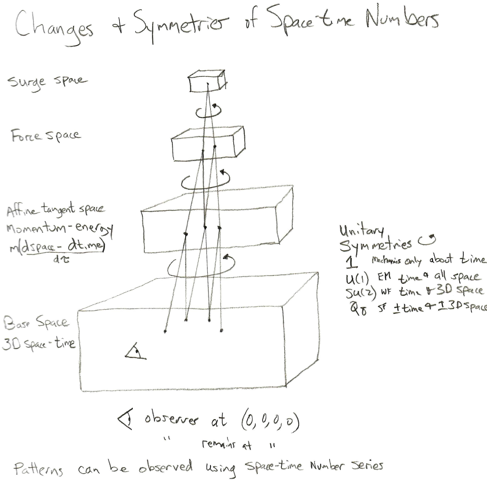

# Space-time Numbers (aka quaternions) Software Development

## Naming the Dragon Correctly

Full disclosure: I have owned quaternions.com since 1997, purchased because I
did not think the scalar of a square of a quaternion event could not be an
accident. It used to be near the top of Google searches until I started to 
host it at Github using mkdocs. I made the move because I found it far easier 
to maintain. So why ever use the name **space-time numbers** for exactly the 
same algebraic structure?

The word **quaternions** is a name for four Roman soldiers. It is found in the
King James version of the Bible for the group that took Saint Peter to be
crusified in Rome back in the day. The Pope has the bones of Saint Peter in a
jar, one of the strange honors of being a Pope. This entire story sounds
irrelevant to the use of this tool to describe Nature. We cannot be certain
that this was the idea behind Hamiliton's choice of a label.

For the generation after the current generation has all come to pass, we should
use a relevant label. Space-time numbers sounds like it should be used for
space-time physics. Now I view space-time numbers as a 3D-vector-scalar, the
scalar is time, the 3D-vector is 3D space.

A similar desire for a "new label" occured when Prof. David Hestenes began
writing all physics equations using Clifford algebras. He called the effort
Geometric Algebra to underline how central geometry was for his vision.

In this effort, the *real numbers are time*, while *3 imaginaries are 3D space*.
Time is the scalar stage for all events. Events lack permanence, so this is
transient math, nothing lasts for ever, most things are fleeting. This math
*must be animated*. The goal of this repository is to build the software stack
needed to animate space-time number math.

## Building-in Fields

Space-time can only provide one kind of information: where-when something is,
nothing else. It is standard practice to add additional information, like there
is a mass with this velocity moving like so. I think it is more precise to put
this information in a tangent space that is all about changes:

Notice that a tangent space subtracts away the observer. Dimensionless
momentum-energy is tiny. Changes in momentum-energy are even smaller. While
there may be changes of higher order, they probably are rare. This would be
consistent with the dominance of second-order differential equations explaining
so much in Nature.

Every point in space-time has this stock of tangent-spaces: momentum-energy,
forces, and surges. In many cases, these will be zeros. One of the strange
lessons of quantum field theory is that while the momentum-energy is often
zero, one cannot say that the variaiton of the momentum-energy is also zero.
That crazy property needs to be part of the implementation of any animation
system.

## Technology in Use Today

The software to manipulate space-time numbers and space-time number series, 
classes Q and Qs respectively, are in the library **Qs.py**. A Jupyter
notebook has been included that shows some basic manipulations that may
not be obvious. The library can be used for both symbolic and numerical
studies with space-time numbers. The programming language is Python that 
stressed that code should be easy to read. The software was refactored so
one can treat both space-time number and space-time number series functions 
like one would treat individual space-time numbers and series.

## Technology for Tomorrow

We need to have a technology stack that can allow users to manipulate
space-time number and series expressions on the web and on a smart phone
with the result being a 3D animation.

I am testing out several alternatives:

* Streamlit
* Pluto.jl
* D3?

## A Comment on Notation

An effort will be made to always used hyphenated notation for
3D-vector-scalars, with the 3D-vector first, then the scalar. This holds for
space-time but also for momentum-energy. This practice will hold for all
values, even potenial $A-\phi$. A thing for me to think about: in the name of
logical consistency, should I refer to electric E-0 and magnetic B-0 fields?
Initially I find the idea uncomfortable, but that is not relevant in the long
term. As space-time number expressions, the scalar will necessarily be zero. I
prefer to be explicit about that zeros that are always there for photons (and
perhaps not for massive systems).

## A Comment on Units

We demand to be able to do any numerical operation in our collection of
numbers. This can only make sense if everything going in has no dimensions. The
same applies to any operator, it needs to be dimensionless so it does not
introduce dimensions by being applied. It may often be awkward to cart around
all these constants. Still, it is required to be faithful to the idea of
numbers.

